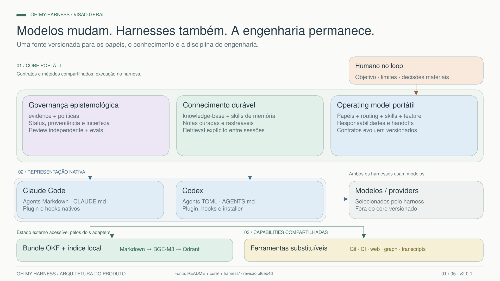

# Architecture presentation

An editable, source-linked overview of oh-my-harness for technical presentations and video recording.
The presentation is in Brazilian Portuguese. This README follows the repository documentation language.

## Open and edit

Open [omh-arquitetura.excalidraw](omh-arquitetura.excalidraw) in
[Excalidraw](https://excalidraw.com). It contains five native frames; shapes, text, and connectors
remain editable. Cards link to the inspected source revision. Each chapter is also available as an
individual Excalidraw file, SVG, and 3840 × 2160 PNG (16:9).

## Presentation order

| Chapter                   | Editable scene                          | Vector                    | 4K image                  |
| ------------------------- | --------------------------------------- | ------------------------- | ------------------------- |
| 01 — System overview      | [Excalidraw](01-arquitetura.excalidraw) | [SVG](01-arquitetura.svg) | [PNG](01-arquitetura.png) |
| 02 — Epistemic governance | [Excalidraw](02-governanca.excalidraw)  | [SVG](02-governanca.svg)  | [PNG](02-governanca.png)  |
| 03 — Durable knowledge    | [Excalidraw](03-memoria.excalidraw)     | [SVG](03-memoria.svg)     | [PNG](03-memoria.png)     |
| 04 — Engineering workflow | [Excalidraw](04-engenharia.excalidraw)  | [SVG](04-engenharia.svg)  | [PNG](04-engenharia.png)  |
| 05 — Component catalog    | [Excalidraw](05-componentes.excalidraw) | [SVG](05-componentes.svg) | [PNG](05-componentes.png) |

## Scope and interpretation

The diagrams document the product at revision
[bf6eb4d53feffa3d135c0fef8afc46e215b26dc4](https://github.com/nelsonfrugeri-tech/oh-my-harness/tree/bf6eb4d53feffa3d135c0fef8afc46e215b26dc4),
inspected on September 8, 2026. They describe components and contracts, not proof that optional
providers are installed or healthy on a particular machine.

- Claude Code and Codex have native adapters. Both can access shared knowledge and configured
  capabilities. Additional harnesses require their own adapter.
- The product contains eight portable roles and one native role per adapter. There are 26 shared
  skills and two adapter skills in the package; each harness uses its own adapter skill.
- The OKF bundle contains immutable Markdown notes and mutable JSON session records. Qdrant is a
  rebuildable index; BAAI/bge-m3 supplies dense and sparse representations combined through RRF.
  Ranking is not calibrated confidence. Raw transcripts and Deja form a separate episodic layer.
- SessionStart emits a content-free pointer. It does not run the knowledge-base agent or retrieve
  content automatically. Curated preservation is explicit through kb-write.
- The feature workflow is adaptive. The delivery diagram is illustrative, not a mandatory sequence
  involving every agent. The create-feature.ts prototype is source-only, not installed runtime.
- The PR gate covers its declared creation paths in trusted repositories. It is not a universal
  access-control boundary. Reviewer isolation differs between the native adapters.
- Colors are editorial groupings, not separate runtime services. Solid and dashed connectors
  distinguish the relationships described by each chapter's labels and notes.

## Sources and maintenance

The editable scene is the presentation source. After a content change, update the complete scene,
the affected individual scene, and both exports together. Preserve the 16:9 frame bounds, source
links, and distinction between shipped behavior and optional integrations. No server, credentials,
or local machine configuration is required to open these files.

Primary source paths for future updates:

- [Product overview](../../README.md)
- [Canonical roles and routing](../../core/agents/routing.json)
- [Evidence contract](../../core/skills/evidence/SKILL.md)
- [Knowledge writing](../../core/skills/kb-write/SKILL.md),
  [retrieval](../../core/skills/kb-retrieval/SKILL.md), and
  [infrastructure](../../core/skills/kb-infra/SKILL.md)
- [Feature orchestration](../../core/skills/feature/SKILL.md)
- [PR quality gate](../../core/hooks/quality-gate.sh)

The original exports used the official Excalidraw 0.18.0 export utilities. All five frames were
visually inspected, with text bounds and native bindings checked. This validates the presentation
artifacts, not the empirical effectiveness of the agents.
